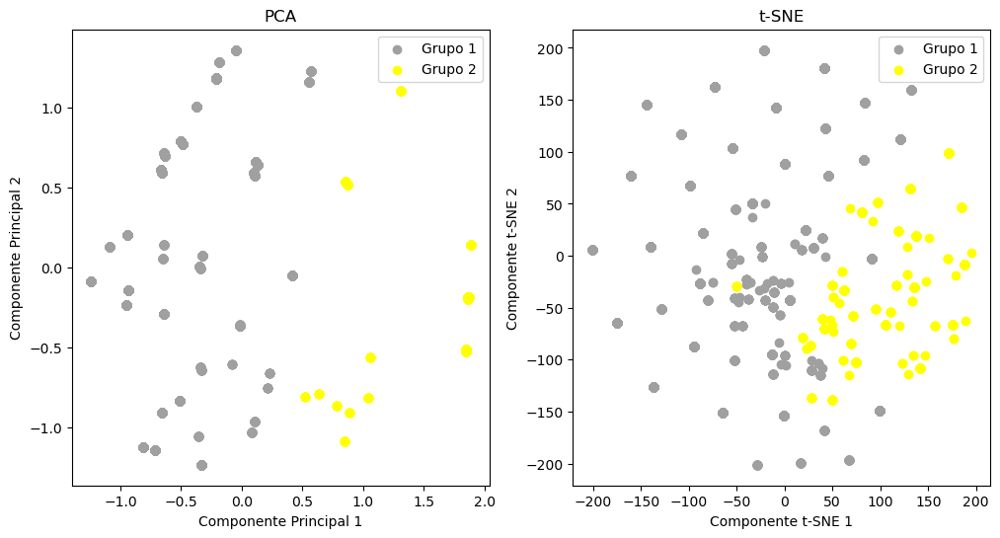

🍄 **Classificação de Cogumelos: Comestível ou Venenoso?**

Este projeto foi desenvolvido como parte do meu portfólio em Ciência de Dados e Matemática Industrial. O objetivo principal é aplicar algoritmos de Machine Learning para determinar se um cogumelo é seguro para consumo ou venenoso, baseando-se em 22 atributos morfológicos.

🎯 **Objetivos do Projeto**

- Análise Exploratória: Identificar padrões visuais e correlações entre características físicas como odor, cor e habitat.
- Engenharia de Atributos: Aplicar técnicas de agrupamento (Clustering) para enriquecer o modelo preditivo.
- Modelagem e Predição: Comparar a performance de diferentes modelos de classificação para garantir segurança máxima nas previsões.

Visualização da correlação:
.

🚀 **Diferenciais Matemáticos**

Como acadêmica de Matemática Industrial, busquei aplicar conceitos que vão além da implementação básica de bibliotecas:

1. Feature Engineering com K-Means

Utilizei o algoritmo K-Means para criar novos agrupamentos latentes sobre as variáveis de haste (stalk), capturando relações não-lineares importantes antes da etapa de classificação final.

2. Redução de Dimensionalidade (PCA & t-SNE)

Para visualizar a separabilidade das classes em um espaço de alta dimensão ($22$ atributos), apliquei:

- PCA (Principal Component Analysis): Para uma projeção linear da variância dos dados.
- SNE: Para mapeamento não-linear, preservando distâncias locais e evidenciando a formação de clusters naturais.

Resultado da Visualização de Clusters:
.

📊 **Métricas de Avaliação**

Dada a natureza do problema (onde um erro pode ser fatal), o foco foi maximizar o Recall para a classe "Venenoso", garantindo que nenhum cogumelo tóxico seja classificado como seguro.

As fórmulas utilizadas para avaliação foram:

$$\text{Accuracy} = \frac{TP + TN}{TP + TN + FP + FN}$$

$$\text{Recall} = \frac{TP}{TP + FN}$$

📈 **Resultados Obtidos**

Os modelos baseados em árvores apresentaram performance superior no conjunto de testes:

| Modelo | Acurácia | F1-Score | Recall (Venenoso) |

| Random Forest | 100% | 1.00 | 1.00 |

| Decision Tree | 100% | 1.00 | 1.00 |

| Logistic Regression | 99.1% | 0.99 | 0.99 |

📂 **Estrutura do Repositório**

- mushroom_classification.ipynb: Notebook Jupyter com toda a análise, tratamento de dados e modelagem.
- mushrooms.csv: Base de dados original (proveniente do UCI Machine Learning Repository).
- images/: Pasta contendo os gráficos de correlação e visualizações de clusters (PCA/t-SNE).

👩‍🔬 **Autora**

**Ellen Rodrigues Ponijaleki Teixeira** *Graduanda em Matemática Industrial — UFPR*
