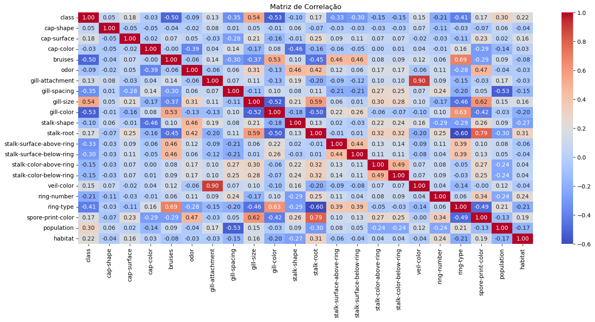
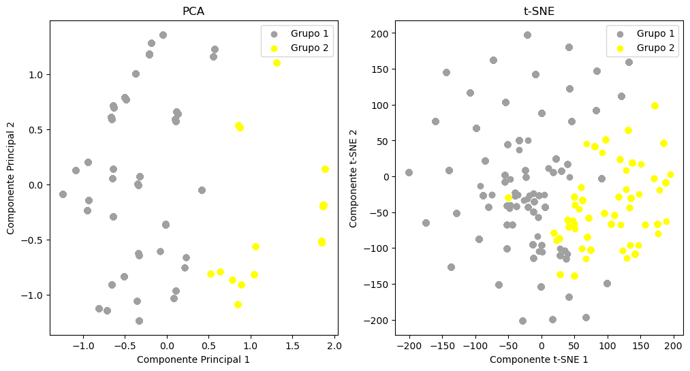

🍄 **Classificação de Cogumelos: Comestível ou Venenoso?**

--------------------------------------------------------------------------------------------------------------------------

📌 **Contexto do Projeto:**

Este foi o meu primeiro projeto prático em Ciência de Dados, desenvolvido originalmente no segundo semestre de **2023** como parte da disciplina de **Machine Learning** da **UFPR (Matemática Industrial)**.
O objetivo principal era criar um modelo de classificação capaz de prever se um cogumelo é **comestível** ou **venenoso** com base em características morfológicas, utilizando o famoso dataset *Mushroom* do repositório UCI.

🛠️ **Tecnologias e Métodos**

- Linguagem: Python.
- Bibliotecas: Pandas, Numpy, SciKit-Learn, Seaborn, Matplotlib.
- Algoritmo Principal: Random Forest Classifier.
- Processamento: Tratamento de variáveis categóricas via Label Encoding.

--------------------------------------------------------------------------------------------------------------------------

**README ORIGINAL:**

🎯 **Objetivos do Projeto**

- Análise Exploratória: Identificar padrões visuais e correlações entre características físicas como odor, cor e habitat.
- Engenharia de Atributos: Aplicar técnicas de agrupamento (Clustering) para enriquecer o modelo preditivo.
- Modelagem e Predição: Comparar a performance de diferentes modelos de classificação para garantir segurança máxima nas previsões.

Visualização da correlação:
.

🚀 **Diferenciais Matemáticos**

Como acadêmica de Matemática Industrial, busquei aplicar conceitos que vão além da implementação básica de bibliotecas:

1. Feature Engineering com K-Means

Utilizei o algoritmo K-Means para criar novos agrupamentos latentes sobre as variáveis de haste (stalk), capturando relações não-lineares importantes antes da etapa de classificação final.

2. Redução de Dimensionalidade (PCA & t-SNE)

Para visualizar a separabilidade das classes em um espaço de alta dimensão ($22$ atributos), apliquei:

- PCA (Principal Component Analysis): Para uma projeção linear da variância dos dados.
- SNE: Para mapeamento não-linear, preservando distâncias locais e evidenciando a formação de clusters naturais.

Resultado da Visualização de Clusters:
.

📊 **Métricas de Avaliação**

Dada a natureza do problema (onde um erro pode ser fatal), o foco foi maximizar o Recall para a classe "Venenoso", garantindo que nenhum cogumelo tóxico seja classificado como seguro.

As fórmulas utilizadas para avaliação foram:

$$\text{Accuracy} = \frac{TP + TN}{TP + TN + FP + FN}$$

$$\text{Recall} = \frac{TP}{TP + FN}$$

📈 **Resultados Obtidos**

Os modelos baseados em árvores apresentaram performance superior no conjunto de testes:

| Modelo | Acurácia | F1-Score | Recall (Venenoso) |

| Random Forest | 100% | 1.00 | 1.00 |

| Decision Tree | 100% | 1.00 | 1.00 |

| Logistic Regression | 99.1% | 0.99 | 0.99 |

📂 **Estrutura do Repositório**

- mushroom_classification.ipynb: Notebook Jupyter com toda a análise, tratamento de dados e modelagem.
- mushrooms.csv: Base de dados original (proveniente do UCI Machine Learning Repository).
- images/: Pasta contendo os gráficos de correlação e visualizações de clusters (PCA/t-SNE).

--------------------------------------------------------------------------------------------------------------------------

📈 **Reflexão e Evolução Técnica (2026)**

Olhando para este projeto com a experiência que adquiri em Pesquisa e Desenvolvimento (P&D) no Instituto LACTEC e meus estudos atuais de Otimização Não Linear e Ciência de Dados, identifico pontos de melhoria:
1. Validação Cruzada: Em 2023, utilizei apenas o split simples (train/test). Em 2026, entendo que a Validação Cruzada (Cross-Validation) é essencial para garantir a robustez do modelo em dados não vistos.
2. Tratamento de Dados: Hoje optaria por técnicas de One-Hot Encoding ou Target Encoding para evitar que o modelo interprete ordens de grandeza inexistentes em variáveis puramente categóricas.
3. Métricas de Avaliação: Além da acurácia, focaria em analisar o Recall e a Matriz de Confusão, visto que, neste problema, um Falso Negativo (dizer que um cogumelo venenoso é comestível) é um erro crítico.

👩‍🔬 **Autora**

**Ellen Rodrigues Ponijaleki Teixeira** | [LinkedIn](www.linkedin.com/in/ellen-r-p-teixeira-9ab349285) | *Graduanda em Matemática Industrial — UFPR*
